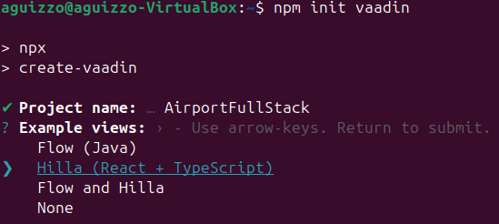
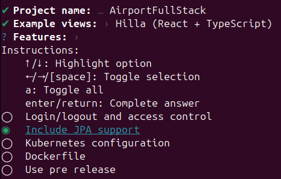

# Project Initialization

## Creating project

```console
npm init vaadin
```




## Frontend Setup

In this project, we will not use the [auto-generated routing from Hilla](https://vaadin.com/docs/latest/hilla/guides/routing). Instead, we will use [React Router](https://reactrouter.com/) (already installed as a dependency) to implement routing from scratch. This approach provides more flexibility, as it eliminates the need to learn Hilla’s default configuration and allows for greater customization in route handling. Additionally, it aligns better with standard React development practices, making the codebase more maintainable and accessible for developers familiar with React Router.

For styling, we will use the Material UI component library.

---

### Setting Up the React Project Structure

#### 1. Install Material UI

To install Material UI and its required dependencies, run the following command:

```sh
npm install @mui/material @emotion/react @emotion/styled
```

#### 2. Remove Unnecessary Files

Delete the `views` folder in `/src/main/frontend` to clean up the project structure.

#### 3. Create the Main Component (`App.tsx`)

In `/src/main/frontend`, create a new file named `App.tsx` and add the following code:

```tsx
import { Container, Typography, Box } from "@mui/material";

const App = () => {
  return (
    <Container maxWidth="md">
      <Box
        sx={{
          display: "flex",
          justifyContent: "center",
          alignItems: "center",
          height: "100vh",
        }}
      >
        <Typography variant="h1" align="center">
          Welcome to the Hilla Project!
        </Typography>
      </Box>
    </Container>
  );
};

export default App;
```

#### 4. Create the Entry Point (`index.tsx`)

In `/src/main/frontend`, create the `index.tsx` file with the following content:

```tsx
import { createRoot } from "react-dom/client";
import { createElement } from "react";
import App from "Frontend/App";

const outlet = document.getElementById("outlet")!;
const root = (outlet as any)._root ?? createRoot(outlet);
(outlet as any)._root = root;
root.render(createElement(App));
```

#### 5. Organize Your Folder Structure

Now, structure your `/src/main/frontend` directory according to your project’s needs.
